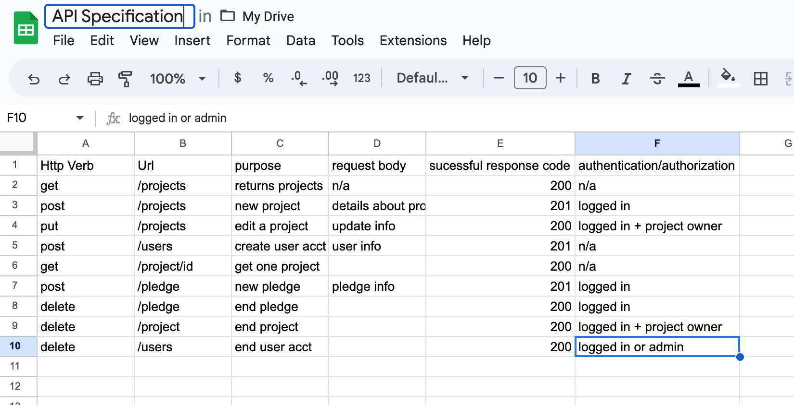

# DRF_project
She Codes DRF Module
Bookarina

by {{ Julie Powell }}
She Codes crowdfunding project - DRF Backend.
About

{{ This crowdfunding site is for authors who wish to raise money to self publish their book. Self publishing is often the only recourse authors have in today's super competitve publishing era. Self publishing can be expensive, though. Crowdfunding to the rescue! }}

Features
{{ The features your MVP will include. (Remember this is a working document, you can change these as you go!) }}
feature
feature

Stretch Goals
{{ Outline three features that will be your stretch goals if you finish your MVP }}

Stretch goal ability to delete a project
Stretch goal pagination and the ability to determine how many items per page shown
Stretch goal 

API Specification

Database Schema

{{  }}

Wireframes
{{  }}

Colour Scheme

{{ /* CSS HEX */
--umber: #756658ff;
--seal-brown: #602C10ff;
--raw-umber: #9A6034ff;
--raisin-black: #1B171Eff;
--dutch-white: #F7E9C8ff; }}

Fonts

{{ [font: josefin sans](../../../Downloads/Josefin_Sans/JosefinSans-VariableFont_wght.ttf) }}

Submission Documentation

{{ Fill this section out for submission }}

Deployed Project: https://crimson-pond-5974.fly.dev/

How To Run
{{ What steps to take to run this code }}

Updated Database Schema
{{ Updated schema }}
image info goes here

Updated Wireframes
{{ Updated wireframes }}
image info goes here

How To Register a New User
{{ Step by step instructions for how to register a new user and create a new project (i.e. endpoints and body data). }}

Screenshots

 A screenshot of Insomnia, demonstrating a successful GET method for any endpoint.

 A screenshot of Insomnia, demonstrating a successful POST method for any endpoint.

 A screenshot of Insomnia, demonstrating a token being returned.

